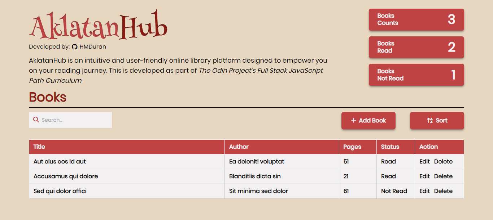

# 

AklatanHub is an intuitive and user-friendly online library platform designed to empower you on your reading journey. This is developed as part of [The Odin Project's Full Stack JavaScript Path Curriculum](https://www.theodinproject.com/lessons/node-path-javascript-library)

## Preview

## Technologies Used

- [HTML](https://developer.mozilla.org/en-US/docs/Web/HTML)
- [Tailwind](https://tailwindcss.com/)
- [JavaScript](https://developer.mozilla.org/en-US/docs/Web/JavaScript)

## Project Link
- [Aklatan Hub](https://library-app-azure.vercel.app/)